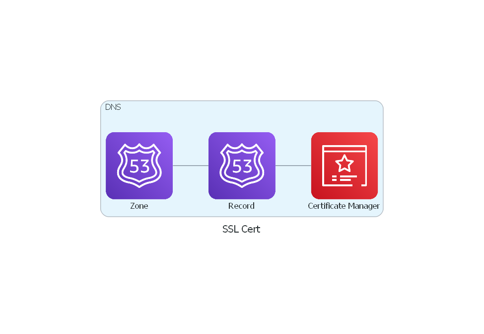

# terraform-aws-sslcert

[](https://github.com/JamesWoolfenden/terraform-aws-sslcert)
[](https://github.com/JamesWoolfenden/terraform-aws-sslcert/releases/latest)
[](https://github.com/JamesWoolfenden/terraform-aws-sslcert/releases/latest)

[](https://www.bridgecrew.cloud/link/badge?vcs=github&fullRepo=JamesWoolfenden%2Fterraform-aws-sslcert&benchmark=CIS+AWS+V1.2)
[](https://github.com/pre-commit/pre-commit)
[](https://www.checkov.io/)
[](https://www.bridgecrew.cloud/link/badge?vcs=github&fullRepo=JamesWoolfenden%2Fterraform-aws-sslcert&benchmark=INFRASTRUCTURE+SECURITY)

Terraform module to provision an SSL certificate.

This follows the terraform example <https://www.terraform.io/docs/providers/aws/r/acm_certificate_validation.html>

---

It's 100% Open Source and licensed under the [APACHE2](LICENSE).

## Usage

This is a very basic example (so far).



Include this repository as a module in your existing Terraform code, as _module.cert.tf_:

```hcl
module "cert" {
  source      = "JamesWoolfenden/sslcert/aws"
  version     = "v0.2.11"
  common_tags = var.common_tags
  domain      = "example.com"
  sub_domain  = "dev"
}
```

<!-- BEGINNING OF PRE-COMMIT-TERRAFORM DOCS HOOK -->
## Requirements

No requirements.

## Providers

| Name | Version |
|------|---------|
| <a name="provider_aws"></a> [aws](#provider\_aws) | n/a |

## Modules

No modules.

## Resources

| Name | Type |
|------|------|
| [aws_acm_certificate.certificate](https://registry.terraform.io/providers/hashicorp/aws/latest/docs/resources/acm_certificate) | resource |
| [aws_acm_certificate_validation.check](https://registry.terraform.io/providers/hashicorp/aws/latest/docs/resources/acm_certificate_validation) | resource |
| [aws_route53_record.valid](https://registry.terraform.io/providers/hashicorp/aws/latest/docs/resources/route53_record) | resource |
| [aws_route53_zone.public](https://registry.terraform.io/providers/hashicorp/aws/latest/docs/data-sources/route53_zone) | data source |

## Inputs

| Name | Description | Type | Default | Required |
|------|-------------|------|---------|:--------:|
| <a name="input_common_tags"></a> [common\_tags](#input\_common\_tags) | Implements the common tags scheme | `map(any)` | n/a | yes |
| <a name="input_domain"></a> [domain](#input\_domain) | The domain name of the zone | `string` | n/a | yes |
| <a name="input_sub_domain"></a> [sub\_domain](#input\_sub\_domain) | The sub-domain | `string` | n/a | yes |
| <a name="input_ttl"></a> [ttl](#input\_ttl) | Time to Live | `number` | `60` | no |

## Outputs

| Name | Description |
|------|-------------|
| <a name="output_arn"></a> [arn](#output\_arn) | The arn of the cert |
| <a name="output_domain_name"></a> [domain\_name](#output\_domain\_name) | The domain name |
| <a name="output_domain_validation_options"></a> [domain\_validation\_options](#output\_domain\_validation\_options) | domain\_validation\_options |
<!-- END OF PRE-COMMIT-TERRAFORM DOCS HOOK -->

## Information

A terraform module to create an SSL cert for a DNS name.

## Related Projects

Check out these related projects.

- [terraform-aws-codebuild](https://github.com/jameswoolfenden/terraform-aws-codebuild) - Making a Build pipeline

## Help

**Got a question?**

File a GitHub [issue](https://github.com/jameswoolfenden/terraform-aws-sslcert/issues).

## Contributing

### Bug Reports & Feature Requests

Please use the [issue tracker](https://github.com/jameswoolfenden/terraform-aws-sslcert/issues) to report any bugs or file feature requests.

## Copyrights

Copyright © 2019-2021 James Woolfenden

## License

[](https://opensource.org/licenses/Apache-2.0)

See [LICENSE](LICENSE) for full details.

Licensed to the Apache Software Foundation (ASF) under one
or more contributor license agreements. See the NOTICE file
distributed with this work for additional information
regarding copyright ownership. The ASF licenses this file
to you under the Apache License, Version 2.0 (the
"License"); you may not use this file except in compliance
with the License. You may obtain a copy of the License at

<https://www.apache.org/licenses/LICENSE-2.0>

Unless required by applicable law or agreed to in writing,
software distributed under the License is distributed on an
"AS IS" BASIS, WITHOUT WARRANTIES OR CONDITIONS OF ANY
KIND, either express or implied. See the License for the
specific language governing permissions and limitations
under the License.

### Contributors

[![James Woolfenden][jameswoolfenden_avatar]][jameswoolfenden_homepage]<br/>[James Woolfenden][jameswoolfenden_homepage]

[jameswoolfenden_homepage]: https://github.com/jameswoolfenden
[jameswoolfenden_avatar]: https://github.com/jameswoolfenden.png?size=150
[github]: https://github.com/jameswoolfenden
[linkedin]: https://www.linkedin.com/in/jameswoolfenden/
[twitter]: https://twitter.com/JimWoolfenden
[share_twitter]: https://twitter.com/intent/tweet/?text=terraform-aws-sslcert&url=https://github.com/jameswoolfenden/terraform-aws-sslcert
[share_linkedin]: https://www.linkedin.com/shareArticle?mini=true&title=terraform-aws-sslcert&url=https://github.com/jameswoolfenden/terraform-aws-sslcert
[share_reddit]: https://reddit.com/submit/?url=https://github.com/jameswoolfenden/terraform-aws-sslcert
[share_facebook]: https://facebook.com/sharer/sharer.php?u=https://github.com/jameswoolfenden/terraform-aws-sslcert
[share_email]: mailto:?subject=terraform-aws-sslcert&body=https://github.com/jameswoolfenden/terraform-aws-sslcert
